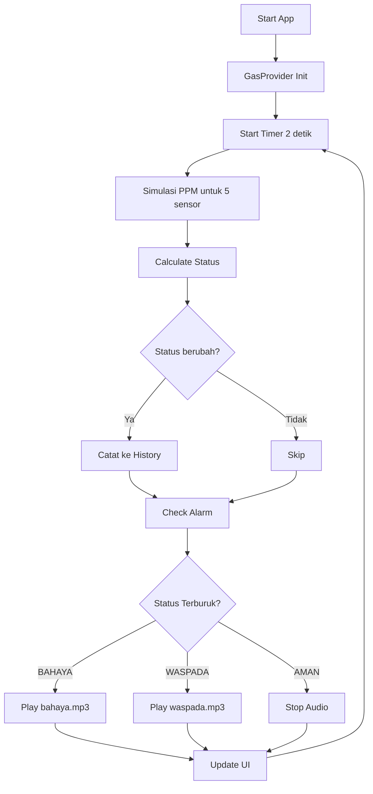

# 📚 DOKUMENTASI PROJECT MONITORING GAS

## 🗂️ STRUKTUR PROJECT

```
monitoring_gas/
├── lib/
│   ├── main.dart                    # Entry point aplikasi
│   ├── models/
│   │   └── gas_data.dart           # Model data sensor
│   ├── providers/
│   │   └── gas_provider.dart       # Logic pembacaan sensor & alarm
│   └── pages/
│       ├── dashboard_page.dart     # Halaman utama
│       ├── chart_page.dart         # Grafik real-time
│       ├── sensor_list_page.dart   # List semua sensor
│       ├── history_page.dart       # Riwayat kejadian
│       └── profile_page.dart       # Edit profile & foto
├── assets/
│   ├── bahaya.mp3                  # Audio alarm bahaya
│   └── waspada.mp3                 # Audio alarm waspada
└── pubspec.yaml                    # Dependencies
```

---

## 🎯 FILE & CODE PENTING

### 1️⃣ **MAIN.dart** - Entry Point Aplikasi
📁 `lib/main.dart`

**FUNGSI UTAMA:**
- **Line 10-17**: Inisialisasi Provider (State Management)
- **Line 44-52**: Navigation antar halaman
- **Line 46-52**: Daftar 5 halaman utama
- **Line 75-89**: Bottom Navigation Bar

```dart
// Line 10-17: Setup Provider untuk manajemen state
void main() {
  runApp(
    ChangeNotifierProvider(
      create: (_) => GasProvider(),  // ← Inisialisasi GasProvider
      child: MyApp(),
    ),
  );
}
```

**5 HALAMAN UTAMA:**
```dart
// Line 46-52
final List<Widget> _pages = [
  const DashboardPage(),      // Halaman utama dengan status keseluruhan
  const ChartPage(),          // Grafik real-time
  const SensorListPage(),     // Daftar sensor + Google Maps
  const HistoryPage(),        // Riwayat kejadian
  const ProfilePage(),        // Edit profile & foto
];
```

---

### 2️⃣ **GAS_DATA.dart** - Model & Threshold Sensor
📁 `lib/models/gas_data.dart`

#### **PENTING! THRESHOLD NIOSH (Line 16-22):**

```dart
static const Map<GasType, GasThreshold> thresholds = {
  // GAS       AMAN (<)    WASPADA (-)     BAHAYA (>)
  GasType.co:  GasThreshold(safeMax: 34,   warningMax: 199),   // CO
  GasType.lpg: GasThreshold(safeMax: 999,  warningMax: 1599),  // LPG
  GasType.nh3: GasThreshold(safeMax: 24,   warningMax: 49),    // NH3
  GasType.ch4: GasThreshold(safeMax: 1000, warningMax: 4999),  // CH4
  GasType.h2s: GasThreshold(safeMax: 1,    warningMax: 9),     // H2S
};
```

**CONTOH PEMBACAAN:**
- **CO = 20 PPM** → AMAN (< 34)
- **CO = 100 PPM** → WASPADA (35-199)
- **CO = 250 PPM** → BAHAYA (> 200)

#### **FUNGSI KRUSIAL:**

**1. Calculate Status (Line 46-51):**
```dart
GasStatus calculateStatus() {
  final threshold = GasThreshold.thresholds[gasType]!;
  if (currentPpm <= threshold.safeMax) return GasStatus.normal;
  if (currentPpm <= threshold.warningMax) return GasStatus.warning;
  return GasStatus.danger;
}
```

**2. Gas Names (Line 53-71):**
```dart
String get gasName {
  switch (gasType) {
    case GasType.co:  return 'CO (Carbon Monoxide)';
    case GasType.lpg: return 'LPG (Propane/Butane)';
    case GasType.nh3: return 'NH3 (Ammonia)';
    case GasType.ch4: return 'CH4 (Metana)';
    case GasType.h2s: return 'H2S (Hydrogen Sulfide)';
  }
}
```

---

### 3️⃣ **GAS_PROVIDER.dart** - OTAK SISTEM (PALING PENTING!)
📁 `lib/providers/gas_provider.dart`

#### **A. INISIALISASI 5 SENSOR (Line 14-55)**

```dart
List<SensorData> sensors = [
  SensorData(
    id: '1',
    name: 'Sensor CO',
    gasType: GasType.co,
    currentPpm: 20,
    status: GasStatus.normal,
    history: [],
  ),
  // ... 4 sensor lainnya (LPG, NH3, CH4, H2S)
];
```

#### **B. SIMULASI PEMBACAAN SENSOR (Line 76-119)**

```dart
void _startSimulation() {
  _timer = Timer.periodic(Duration(seconds: 2), (timer) {
    _cycleCounter++;

    for (var sensor in sensors) {
      final threshold = GasThreshold.thresholds[sensor.gasType]!;
      double targetPpm;

      // SIKLUS SIMULASI (30 detik per siklus):
      if (_cycleCounter <= 15) {
        // 0-30 detik: AMAN
        targetPpm = threshold.safeMax * 0.6;
      } else if (_cycleCounter <= 25) {
        // 30-50 detik: WASPADA
        targetPpm = threshold.safeMax + (threshold.warningMax - threshold.safeMax) * 0.5;
      } else if (_cycleCounter <= 30) {
        // 50-60 detik: BAHAYA
        targetPpm = threshold.warningMax + random.nextDouble() * threshold.warningMax * 0.2;
      } else {
        // Reset siklus
        _cycleCounter = 0;
        targetPpm = threshold.safeMax * 0.5;
      }

      // Update nilai sensor
      sensor.currentPpm = targetPpm;
      sensor.history.add(GasData(sensor.currentPpm, DateTime.now()));

      // Hitung status baru
      GasStatus oldStatus = sensor.status;
      sensor.status = sensor.calculateStatus();

      // Catat perubahan status ke history
      if (oldStatus != sensor.status) {
        historyEvents.insert(0, HistoryEvent(...));
      }
    }

    _checkAlarm();  // Cek apakah perlu bunyi alarm
    notifyListeners();  // Update UI
  });
}
```

#### **C. SISTEM ALARM AUDIO (Line 122-162) ⚠️**

```dart
void _checkAlarm() async {
  // Cek status terburuk dari semua sensor
  bool hasDanger = sensors.any((s) => s.status == GasStatus.danger);
  bool hasWarning = sensors.any((s) => s.status == GasStatus.warning);

  GasStatus targetStatus = hasDanger
      ? GasStatus.danger
      : hasWarning
          ? GasStatus.warning
          : GasStatus.normal;

  // Jika status berubah, update audio
  if (_currentAlarmStatus != targetStatus) {
    _currentAlarmStatus = targetStatus;

    await _audioPlayer.stop();

    if (targetStatus == GasStatus.danger) {
      // STATUS BAHAYA → Play bahaya.mp3 (loop)
      _isAlarmPlaying = true;
      await _audioPlayer.setReleaseMode(ReleaseMode.loop);
      await _audioPlayer.play(AssetSource('bahaya.mp3'));

    } else if (targetStatus == GasStatus.warning) {
      // STATUS WASPADA → Play waspada.mp3 (loop)
      _isAlarmPlaying = true;
      await _audioPlayer.setReleaseMode(ReleaseMode.loop);
      await _audioPlayer.play(AssetSource('waspada.mp3'));

    } else {
      // STATUS NORMAL → Stop audio
      _isAlarmPlaying = false;
    }
  }
}
```

**CARA KERJA ALARM:**
1. Cek status dari 5 sensor
2. Ambil status terburuk (Bahaya > Waspada > Aman)
3. Jika ada yang BAHAYA → Play `bahaya.mp3` (loop)
4. Jika ada yang WASPADA (tapi tidak ada bahaya) → Play `waspada.mp3` (loop)
5. Jika semua AMAN → Stop audio
6. Audio akan otomatis berganti saat status berubah

#### **D. OVERALL STATUS (Line 140-152)**

```dart
GasStatus get overallStatus {
  // WORST CASE: Ambil status terburuk
  if (sensors.any((s) => s.status == GasStatus.danger)) return GasStatus.danger;
  if (sensors.any((s) => s.status == GasStatus.warning)) return GasStatus.warning;
  return GasStatus.normal;
}

String get overallStatusText {
  switch (overallStatus) {
    case GasStatus.normal:  return 'AMAN';
    case GasStatus.warning: return 'WASPADA';
    case GasStatus.danger:  return 'BAHAYA';
  }
}
```

---

### 4️⃣ **DASHBOARD_PAGE.dart** - Tampilan Utama
📁 `lib/pages/dashboard_page.dart`

**KOMPONEN UTAMA:**
- **Line 17**: Status indicators (3 lampu: merah/orange/hijau)
- **Line 21**: Badge status keseluruhan (AMAN/WASPADA/BAHAYA)
- **Line 23**: Grid 5 sensor dengan nilai PPM
- **Line 25**: Ringkasan statistik (berapa sensor aman/waspada/bahaya)

#### **Status Indicators (Line 33-44)**
```dart
Widget _buildStatusIndicators(GasStatus status) {
  return Row(
    children: [
      // Lampu Merah (Bahaya)
      Container(
        width: 20,
        height: 20,
        decoration: BoxDecoration(
          color: status == GasStatus.danger
              ? Colors.red
              : Colors.red.withValues(alpha: 0.3),
          shape: BoxShape.circle
        )
      ),
      // Lampu Orange (Waspada)
      Container(...),
      // Lampu Hijau (Aman)
      Container(...),
    ],
  );
}
```

#### **Overall Status Badge (Line 46-84)**
```dart
Widget _buildOverallStatusBadge(GasProvider provider) {
  Color statusColor;
  IconData statusIcon;

  switch (provider.overallStatus) {
    case GasStatus.normal:
      statusColor = Colors.green;
      statusIcon = Icons.check_circle;
    case GasStatus.warning:
      statusColor = Colors.orange;
      statusIcon = Icons.warning;
    case GasStatus.danger:
      statusColor = Colors.red;
      statusIcon = Icons.dangerous;
  }

  return Container(
    // Badge besar dengan ikon dan teks status
    child: Row(
      children: [
        Icon(statusIcon, color: statusColor, size: 40),
        Text(provider.overallStatusText),  // AMAN/WASPADA/BAHAYA
      ],
    ),
  );
}
```

#### **Grid 5 Sensor (Line 86-128)**
```dart
Widget _buildSensorCards(List<SensorData> sensors) {
  return GridView.builder(
    gridDelegate: SliverGridDelegateWithFixedCrossAxisCount(
      crossAxisCount: 2,  // 2 kolom
      crossAxisSpacing: 12,
      mainAxisSpacing: 12,
      childAspectRatio: 1.3,
    ),
    itemCount: sensors.length,  // 5 sensor
    itemBuilder: (context, index) {
      var sensor = sensors[index];
      return Container(
        child: Column(
          children: [
            Text(sensor.shortName),  // CO, LPG, NH3, CH4, H2S
            Text('${sensor.currentPpm.toStringAsFixed(1)} ppm'),  // Nilai PPM
            Text(sensor.status),  // AMAN/WASPADA/BAHAYA
          ],
        ),
      );
    },
  );
}
```

#### **Quick Stats (Line 130-155)**
```dart
Widget _buildQuickStats(List<SensorData> sensors) {
  int safeCount = sensors.where((s) => s.status == GasStatus.normal).length;
  int warningCount = sensors.where((s) => s.status == GasStatus.warning).length;
  int dangerCount = sensors.where((s) => s.status == GasStatus.danger).length;

  return Container(
    child: Row(
      children: [
        _buildStatItem('AMAN', safeCount, Colors.green),
        _buildStatItem('WASPADA', warningCount, Colors.orange),
        _buildStatItem('BAHAYA', dangerCount, Colors.red),
      ],
    ),
  );
}
```

---

### 5️⃣ **SENSOR_LIST_PAGE.dart** - Daftar Sensor + Google Maps
📁 `lib/pages/sensor_list_page.dart`

#### **FITUR GOOGLE MAPS (Line 10-40)**

```dart
Future<void> _openGoogleMaps(BuildContext context) async {
  final url = Uri.parse('https://maps.app.goo.gl/nF5JmxUwTZHU2Bkj9?g_st=ipc');

  try {
    if (await canLaunchUrl(url)) {
      await launchUrl(
        url,
        mode: LaunchMode.externalApplication,  // Buka di Google Maps app
      );
    } else {
      ScaffoldMessenger.of(context).showSnackBar(
        SnackBar(content: Text('Tidak dapat membuka Google Maps')),
      );
    }
  } catch (e) {
    ScaffoldMessenger.of(context).showSnackBar(
      SnackBar(content: Text('Error: $e')),
    );
  }
}
```

#### **Tombol Lokasi di Setiap Sensor (Line 138-154)**

```dart
Widget _buildSensorCard(BuildContext context, SensorData sensor) {
  return Container(
    child: Column(
      children: [
        // ... Info sensor (nama, PPM, status, threshold)

        // TOMBOL LOKASI (Line 138-154)
        SizedBox(
          width: double.infinity,
          child: ElevatedButton.icon(
            onPressed: () => _openGoogleMaps(context),
            icon: Icon(Icons.location_on, size: 18),
            label: Text('Lihat Lokasi Sensor'),
            style: ElevatedButton.styleFrom(
              backgroundColor: Colors.white,
              foregroundColor: Color(0xFF00BFA5),
            ),
          ),
        ),
      ],
    ),
  );
}
```

**CARA KERJA:**
1. User tap tombol "Lihat Lokasi Sensor"
2. Aplikasi membuka Google Maps
3. Maps menunjukkan lokasi: https://maps.app.goo.gl/nF5JmxUwTZHU2Bkj9

---

### 6️⃣ **PROFILE_PAGE.dart** - Edit Profile + Foto
📁 `lib/pages/profile_page.dart`

#### **DATA PROFILE (Line 14-18)**
```dart
class _ProfilePageState extends State<ProfilePage> {
  // Data disimpan di memory (tidak persistent)
  String _name = 'John Doe';
  String _email = 'johndoe@email.com';
  String _phone = '+62 812 3456 7890';
  String _location = 'Jakarta, Indonesia';
  String? _profileImagePath;  // Path foto profil
}
```

#### **PICK IMAGE + REQUEST PERMISSION (Line 23-100)**

```dart
Future<void> _pickImage() async {
  try {
    PermissionStatus status;

    // REQUEST PERMISSION (Line 30-43)
    if (Platform.isAndroid) {
      final androidInfo = await getAndroidVersion();
      if (androidInfo >= 33) {
        // Android 13+ → Request photos permission
        status = await Permission.photos.request();
      } else {
        // Android 12- → Request storage permission
        status = await Permission.storage.request();
      }
    } else if (Platform.isIOS) {
      // iOS → Request photos permission
      status = await Permission.photos.request();
    }

    // JIKA PERMISSION DIBERIKAN (Line 45-70)
    if (status.isGranted) {
      final XFile? image = await _picker.pickImage(
        source: ImageSource.gallery,
        maxWidth: 1800,
        maxHeight: 1800,
        imageQuality: 85,
      );

      if (image != null) {
        setState(() {
          _profileImagePath = image.path;  // Simpan path foto
        });

        ScaffoldMessenger.of(context).showSnackBar(
          SnackBar(content: Text('Foto profil berhasil diubah!')),
        );
      }
    }

    // JIKA PERMISSION DITOLAK (Line 71-81)
    else if (status.isDenied) {
      ScaffoldMessenger.of(context).showSnackBar(
        SnackBar(content: Text('Izin akses galeri diperlukan')),
      );
    }

    // JIKA PERMISSION DITOLAK PERMANEN (Line 82-86)
    else if (status.isPermanentlyDenied) {
      _showPermissionDialog();  // Dialog untuk buka Settings
    }
  } catch (e) {
    // Error handling
  }
}
```

#### **DIALOG PERMISSION (Line 113-141)**
```dart
void _showPermissionDialog() {
  showDialog(
    context: context,
    builder: (context) => AlertDialog(
      title: Text('Izin Diperlukan'),
      content: Text('Aplikasi membutuhkan izin akses galeri...'),
      actions: [
        TextButton(
          onPressed: () => Navigator.pop(context),
          child: Text('Batal'),
        ),
        ElevatedButton(
          onPressed: () {
            Navigator.pop(context);
            openAppSettings();  // Buka Settings HP
          },
          child: Text('Buka Settings'),
        ),
      ],
    ),
  );
}
```

#### **EDIT FIELD (Line 143-187)**
```dart
Future<void> _showEditDialog(String title, String currentValue, Function(String) onSave) {
  final controller = TextEditingController(text: currentValue);

  return showDialog(
    context: context,
    builder: (context) => AlertDialog(
      title: Text('Edit $title'),
      content: TextField(
        controller: controller,
        decoration: InputDecoration(hintText: 'Masukkan $title'),
      ),
      actions: [
        TextButton(
          onPressed: () => Navigator.pop(context),
          child: Text('Batal'),
        ),
        ElevatedButton(
          onPressed: () {
            onSave(controller.text);  // Simpan nilai baru
            Navigator.pop(context);
          },
          child: Text('Simpan'),
        ),
      ],
    ),
  );
}
```

**CARA EDIT:**
```dart
// Contoh edit nama (Line 140-142)
_buildInfoCard(
  Icons.person_outline,
  'Nama',
  _name,
  onEdit: () => _showEditDialog('Nama', _name, (value) {
    setState(() => _name = value);  // Update nama
  }),
)
```

---

### 7️⃣ **CHART_PAGE.dart** - Grafik Real-time
📁 `lib/pages/chart_page.dart`

**FITUR:**
- Grafik line chart untuk 5 sensor
- Update real-time setiap 2 detik
- Menampilkan data 24 jam terakhir
- Menggunakan package `fl_chart`

---

### 8️⃣ **HISTORY_PAGE.dart** - Riwayat Kejadian
📁 `lib/pages/history_page.dart`

**FITUR:**
- List semua perubahan status sensor
- Menampilkan: nama sensor, gas, PPM, status, timestamp
- Sorted dari terbaru ke terlama

---

## 🔧 DEPENDENCIES (pubspec.yaml)

```yaml
dependencies:
  flutter:
    sdk: flutter

  # State Management
  provider: ^6.1.5+1

  # UI Components
  fl_chart: ^1.1.1              # Grafik real-time
  cupertino_icons: ^1.0.8

  # Audio & Media
  audioplayers: ^6.5.1          # Play audio alarm
  image_picker: ^1.2.1          # Pilih foto dari galeri

  # Permissions
  permission_handler: ^11.3.1   # Request permission

  # Utilities
  intl: ^0.20.2                 # Format tanggal/waktu
  url_launcher: ^6.3.1          # Buka URL eksternal (Google Maps)

flutter:
  assets:
    - assets/bahaya.mp3          # Audio saat status BAHAYA
    - assets/waspada.mp3         # Audio saat status WASPADA
```

---

## ⚙️ CARA KERJA SISTEM

### **ALUR PEMBACAAN SENSOR:**



### **DETAIL ALUR:**

1. **Inisialisasi (main.dart:10-17)**
   - Create `GasProvider`
   - Setup 5 sensor
   - Start timer simulasi

2. **Simulasi Sensor (gas_provider.dart:76-119)**
   - Timer berjalan setiap 2 detik
   - Generate nilai PPM random
   - Siklus: 30 detik AMAN → 20 detik WASPADA → 10 detik BAHAYA → Reset

3. **Perhitungan Status (gas_data.dart:46-51)**
   - Bandingkan PPM dengan threshold NIOSH
   - Return: `normal`, `warning`, atau `danger`

4. **Trigger Alarm (gas_provider.dart:122-162)**
   - Cek status terburuk dari 5 sensor
   - Jika BAHAYA → Play `bahaya.mp3` (loop)
   - Jika WASPADA → Play `waspada.mp3` (loop)
   - Jika AMAN → Stop audio
   - Audio otomatis berganti saat status berubah

5. **Update UI (semua pages)**
   - `Consumer<GasProvider>` mendengarkan perubahan
   - `notifyListeners()` di-call → UI otomatis update
   - Dashboard, Chart, Sensor List, History semua ter-update real-time

---

## 📱 FITUR APLIKASI

| No | Fitur | File | Line Code | Deskripsi |
|----|-------|------|-----------|-----------|
| 1 | **Dashboard** | `dashboard_page.dart` | 1-182 | Status keseluruhan + grid 5 sensor |
| 2 | **Grafik Real-time** | `chart_page.dart` | All | Line chart untuk 5 sensor |
| 3 | **List Sensor** | `sensor_list_page.dart` | 78-158 | Detail sensor + threshold NIOSH |
| 4 | **History Events** | `history_page.dart` | All | Riwayat perubahan status |
| 5 | **Edit Profile** | `profile_page.dart` | 23-141 | Edit data + foto profil |
| 6 | **Google Maps** | `sensor_list_page.dart` | 10-40, 142 | Buka lokasi sensor di Maps |
| 7 | **Alarm Audio** | `gas_provider.dart` | 122-162 | Play audio waspada/bahaya |
| 8 | **Permission Handler** | `profile_page.dart` | 30-43 | Request akses galeri |
| 9 | **Simulasi Sensor** | `gas_provider.dart` | 76-119 | Generate nilai PPM otomatis |
| 10 | **Threshold NIOSH** | `gas_data.dart` | 16-22 | Standar batas aman gas |

---

## 🚀 PROSEDUR PENGOPERASIAN

### **1. INSTALASI**

```bash
# Clone/Download project
cd monitoring_gas

# Install dependencies
flutter pub get

# Run di device/emulator
flutter run
```

### **2. PENGGUNAAN APLIKASI**

#### **A. Dashboard (Halaman Utama)**
- Status indicators (3 lampu merah/orange/hijau)
- Badge status keseluruhan: **AMAN** / **WASPADA** / **BAHAYA**
- Grid 5 sensor dengan nilai PPM real-time
- Ringkasan: Berapa sensor yang aman/waspada/bahaya

#### **B. Chart (Grafik)**
- Line chart untuk 5 sensor
- Sumbu X: Waktu (24 jam terakhir)
- Sumbu Y: Nilai PPM
- Update otomatis setiap 2 detik

#### **C. Sensor (Daftar Sensor)**
- Detail lengkap setiap sensor:
  - Nama gas (CO, LPG, NH3, CH4, H2S)
  - Nilai PPM saat ini
  - Status (AMAN/WASPADA/BAHAYA)
  - Threshold NIOSH (batas aman/waspada/bahaya)
- **Tombol "Lihat Lokasi Sensor"**:
  - Tap → Buka Google Maps
  - Menunjukkan lokasi sensor

#### **D. History (Riwayat)**
- List semua perubahan status
- Info: Sensor, Gas, PPM, Status, Waktu
- Sorted dari terbaru

#### **E. Profile (Edit Profile)**
- Foto profil:
  - Tap ikon kamera → Pilih dari galeri
  - Request permission otomatis
  - Jika ditolak → Dialog buka Settings
- Edit data:
  - Tap ikon pensil di setiap field
  - Edit: Nama, Email, Telepon, Lokasi
- **Data tidak persistent** (reset saat app ditutup)

### **3. SISTEM ALARM**

#### **Cara Kerja:**
1. Sistem cek status dari 5 sensor setiap 2 detik
2. Ambil status terburuk (WORST CASE)
3. Play audio sesuai status:
   - **BAHAYA**: `bahaya.mp3` (loop)
   - **WASPADA**: `waspada.mp3` (loop)
   - **AMAN**: Stop audio

#### **Contoh Skenario:**
```
Waktu 0-30 detik:
- Semua sensor AMAN
- Audio: [Tidak ada]

Waktu 30-50 detik:
- CO: WASPADA (100 PPM)
- LPG, NH3, CH4, H2S: AMAN
- Overall Status: WASPADA
- Audio: waspada.mp3 (loop)

Waktu 50-60 detik:
- CO: BAHAYA (250 PPM)
- LPG: WASPADA
- NH3, CH4, H2S: AMAN
- Overall Status: BAHAYA
- Audio: bahaya.mp3 (loop) ← Otomatis ganti dari waspada.mp3

Waktu 60+ detik:
- Reset siklus, semua AMAN
- Audio: [Stop]
```

### **4. SIMULASI SENSOR**

**Siklus Otomatis (60 detik):**
```
0-30 detik  : AMAN     (PPM < safeMax)
30-50 detik : WASPADA  (PPM antara safeMax-warningMax)
50-60 detik : BAHAYA   (PPM > warningMax)
60+ detik   : Reset ke awal
```

**Untuk Testing Manual:**
- Edit nilai di `gas_provider.dart:86-96`
- Ubah durasi siklus
- Set nilai PPM manual

---

## 🔐 PERMISSIONS

### **Android (AndroidManifest.xml)**
```xml
<!-- Akses Galeri -->
<uses-permission android:name="android.permission.READ_MEDIA_IMAGES" />
<uses-permission android:name="android.permission.READ_EXTERNAL_STORAGE"
    android:maxSdkVersion="32" />
```

### **iOS (Info.plist)**
```xml
<key>NSPhotoLibraryUsageDescription</key>
<string>Aplikasi membutuhkan akses ke galeri untuk mengubah foto profil</string>
```

---

## 📊 THRESHOLD NIOSH (STANDAR KESELAMATAN)

| Gas | Formula | Batas AMAN | Batas WASPADA | Batas BAHAYA | Bahaya Kesehatan |
|-----|---------|------------|---------------|--------------|------------------|
| **CO** | Carbon Monoxide | < 34 PPM | 35-199 PPM | > 200 PPM | Keracunan, pusing, mual, kematian |
| **LPG** | Propane/Butane | < 999 PPM | 1000-1599 PPM | > 1600 PPM | Ledakan, kebakaran, asphyxiation |
| **NH3** | Ammonia | < 24 PPM | 25-49 PPM | > 50 PPM | Iritasi mata/hidung, luka bakar |
| **CH4** | Metana | < 1000 PPM | 1001-4999 PPM | > 5000 PPM | Ledakan, asphyxiation |
| **H2S** | Hydrogen Sulfide | < 1 PPM | 2-9 PPM | > 10 PPM | Keracunan fatal, kelumpuhan |

**Sumber:** NIOSH (National Institute for Occupational Safety and Health)

---

## 🐛 TROUBLESHOOTING

### **1. Audio Tidak Bunyi**
**Penyebab:**
- File audio tidak ada
- Volume HP mute

**Solusi:**
```bash
# Pastikan file audio ada
ls assets/
# Output harus ada: bahaya.mp3, waspada.mp3

# Cek pubspec.yaml
flutter pub get
flutter clean
flutter run
```

### **2. Permission Galeri Tidak Muncul**
**Penyebab:**
- Permission sudah pernah ditolak

**Solusi:**
1. Uninstall aplikasi
2. Install ulang
3. Atau: Settings HP → Apps → monitoring_gas → Permissions → Photos → Allow

### **3. Google Maps Tidak Buka**
**Penyebab:**
- Google Maps tidak terinstall
- URL tidak valid

**Solusi:**
- Install Google Maps di HP
- Atau akan buka di browser

### **4. Sensor Tidak Update**
**Penyebab:**
- Timer tidak berjalan
- Provider tidak di-listen

**Solusi:**
```bash
# Restart aplikasi
flutter run

# Check console log
# Harus ada output setiap 2 detik
```

---

## 📝 CATATAN PENTING

### **Data Persistence:**
- ❌ Profile data **TIDAK** disimpan (reset saat app ditutup)
- ❌ Foto profil **TIDAK** disimpan
- ✅ History events tersimpan selama app berjalan
- ✅ Sensor data tersimpan selama app berjalan

**Jika ingin data persistent:**
- Tambahkan `shared_preferences` atau `sqflite`
- Simpan data ke local storage

### **Audio Files:**
- Format: MP3
- Lokasi: `assets/bahaya.mp3`, `assets/waspada.mp3`
- Mode: Loop (berulang terus)
- Berhenti: Saat status kembali AMAN

### **Simulasi vs Real Sensor:**
- Saat ini: **SIMULASI** (random PPM)
- Untuk sensor real:
  - Ganti `_startSimulation()` dengan pembacaan sensor hardware
  - Gunakan serial communication / Bluetooth / WiFi
  - Parse data dari sensor MQ series (MQ-2, MQ-7, dll)

---

## 🎓 REFERENSI

1. **NIOSH Pocket Guide**: https://www.cdc.gov/niosh/npg/
2. **Flutter Documentation**: https://flutter.dev/docs
3. **Provider Package**: https://pub.dev/packages/provider
4. **AudioPlayers**: https://pub.dev/packages/audioplayers
5. **FL Chart**: https://pub.dev/packages/fl_chart
6. **Image Picker**: https://pub.dev/packages/image_picker
7. **Permission Handler**: https://pub.dev/packages/permission_handler
8. **URL Launcher**: https://pub.dev/packages/url_launcher

---

## 👨‍💻 DEVELOPER NOTES

### **Untuk Modifikasi:**

1. **Ubah Threshold:**
   - Edit `lib/models/gas_data.dart:16-22`
   - Sesuaikan dengan standar yang diinginkan

2. **Ubah Siklus Simulasi:**
   - Edit `lib/providers/gas_provider.dart:86-96`
   - Ubah durasi AMAN/WASPADA/BAHAYA

3. **Tambah Sensor:**
   - Tambah enum di `gas_data.dart:8`
   - Tambah threshold di `gas_data.dart:16-22`
   - Tambah sensor di `gas_provider.dart:14-55`

4. **Ganti Audio:**
   - Replace file `assets/bahaya.mp3` dan `assets/waspada.mp3`
   - Atau ubah nama file di `gas_provider.dart:132, 144`

5. **Ubah Lokasi Maps:**
   - Edit URL di `sensor_list_page.dart:12`
   - Ganti dengan URL Google Maps lokasi sensor Anda

---

## 📄 LICENSE

Project ini dibuat untuk keperluan monitoring gas industri/rumah tangga.
Gunakan dengan bijak dan sesuai standar keselamatan.

---

**Last Updated:** 2025-12-07
**Version:** 1.0.0
**Flutter SDK:** ^3.10.0-290.4.beta
